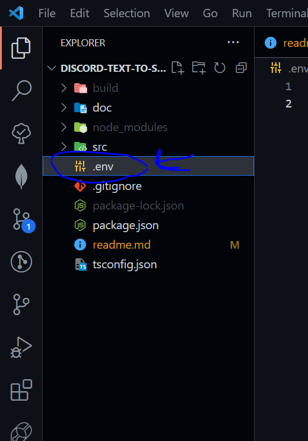

# TypeScript TTS-Bot

## Requirements

* nodejs
* npm package manager
* git
* TypeScript
* MongoDB Databank

## Setup

1. Cloning the repository
```bash
git clone https://github.com/roteKlaue/TTS-Discord-Bot
```

2. Downloading NPM packages

```bach
npm i
```

3. compiling the code

```bash
tsc
```

4. Creating a new Database

Go to https://www.mongodb.com/
and create a new free databank

5. Enabling databank access
   
   

6. Creating .env file



